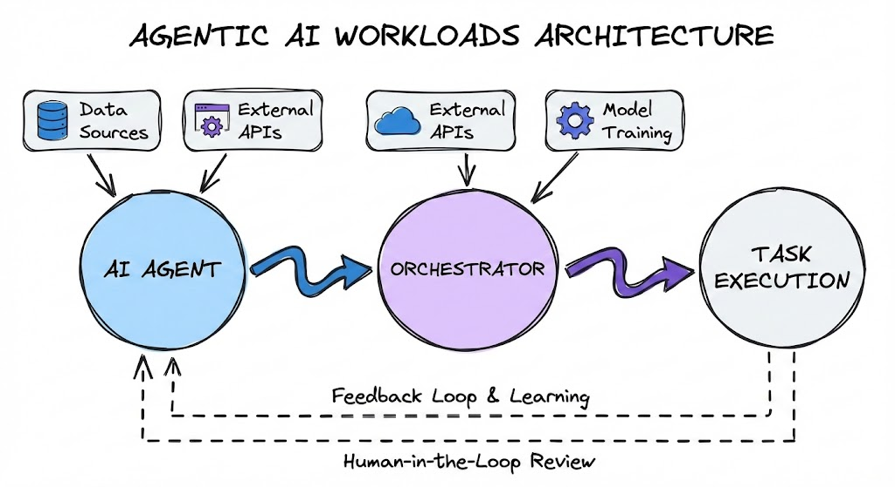

# Agentic AI The Hard Way

This tutorial contains two full, real-world scenarios for Agentic AI. As the industry moves from more of a GenAI mindset to an autonomous/Agentic AI way of thinking, having a few key scenarios that engineers can use to not only learn about Agentic AI, but get ideas on what they can implement with be the new need.

**PLEASE NOTE:** This is currently a WIP. If you click a link and it doesn't work or is blank, that is because this project is still being worked on.

## The Scenarios

There will be three scenarios that you can follow throughout this tutorial:

1. Platform Engineering Assistant
2. The Observer
3. Autonomous k8s Engineer

All projects have one goal - give you a real-world, production-grade experience for thinking about and implementing Agentic AI workflows from the Agent build to the runtime to the scalability, security, and everything in-between.

### Platform Engineering Assistant

The Platform Engineering assistant has a goal of helping DevOps, Platform Engineers, and SREs find a solid balance between helping with implementation from an autonomy perspective. The important thing to keep in mind is there are different levels on autonomy ranging from just about zero control of what the Agent can access and the actions it can perform to an Agent having full control of an environment.

The goal with an assistant, in this case, is to find a middle ground. You want the Agent to be able to perform actions, but with Human-In-The-Loop.

### The Observer

There's nothing like waking up at 2:00 AM to an alert and having to stay awake for 1.5 hours looking through logs with no end in sight to actually figuring out the issue. On the opposite, yet same spectrum, what if you're deploying a new application stack or piece of infrastructure and something goes wrong? Your first thought is to go look at logs, traces, metrics, only to be bogged down by it.

The Observer helps in all things monitoring and observability to help you figure out what an issue is or potentially what an issue could be even before it happens.

### The Autonomous k8s Engineer

The autonomous k8s engineer takes autonomy to a whole other level. It can figure out what is going on, fix the issue, deploy what is needed, and ensure the environment is running smooth all without you having to even know about it.

## Technology/Stack Details

You will be using the following technologies and platforms to set up an Agentic environment.

1. Kubernetes
    - The orchestration system used to run Agents.
2. Model Context Protocol (MCP)
    - MCP Servers expose specialized tools to Agents to perform particular tasks. For example, there is a k8s MCP Server that has tools for things like listing pods, looking at events, deploying workloads, and troubleshooting. This extends the capabilities of the Agent as its trained on general k8s data, but not specialized k8s needs.
3. CrewAI
    - One of the Agentic frameworks for building Agents, connecting to LLMs, and various other methods of Agentic workflows in Python.
4. Kagent
    - An Agentic framework and runtime used to create Agents in a declarative method and deploy them on Kubernetes.
5. Agent Skills
    - Like an external RAG. Skills contain anything from code examples to PDFs to specialized prompts.
6. Monitoring and Observability
    - All things logs, traces, and metrics for Agentic traffic ranging from how the Agent is working to the traffic flowing within the gateway. Observability in AI ranges from figuring out issues to understanding token usage and cost.
7. AI Gateway
    - For all things monitoring, observability, and security from Agents to LLMs, MCP servers, and other agents. Regardless of where AI traffic is going, packets are flowing from one place to another. Those packets, at some point, will need to be looked at and secured. Think of it like the tunnel from point A to point B.
8. Large Language Models (LLM) both open-source (Llama) and provider-based (Claude)
    - LLMs are the "new wave Models" that many organizations are focused on. They are definitely the standard/default at this point. They differ though ranging from SaaS-based Models (like Claude, Gemini, GPT, etc.) to open-source Models that you can control, fine-tune, and run in your environment (like Deepseek and Llama)
9. AI Security
    - Rate limiting, prompt guards, authentication, and MCP security

## Labs

1. [Prerequisites](https://github.com/AdminTurnedDevOps/Agentic-AI-The-Hard-Way/blob/main/prerequisites.md)
2. [Kubernetes Cluster Creation](https://github.com/AdminTurnedDevOps/Agentic-AI-The-Hard-Way/blob/main/k8s-terraform/setup.md)

### Platform Engineering Assistant Labs

These labs will use Llama for the LLM, Kubernetes for the Agent runtime, and 

1. [Deploy kagent](https://github.com/AdminTurnedDevOps/Agentic-AI-The-Hard-Way/blob/main/platform-engineering-assistant/deploy-kagent.md)
2. [Create A Llama Deployment](https://github.com/AdminTurnedDevOps/Agentic-AI-The-Hard-Way/blob/main/platform-engineering-assistant/deploy-llama.md)
3. [Create an Agent](https://github.com/AdminTurnedDevOps/Agentic-AI-The-Hard-Way/blob/main/platform-engineering-assistant/create-agent.md)
4. [Deploy Agentgateway](https://github.com/AdminTurnedDevOps/Agentic-AI-The-Hard-Way/blob/main/platform-engineering-assistant/deploy-agw.md)
5. [Set Up MCP Server Tool]()

### The Observer Labs

These labs will use Claude for the LLM, 

1. [Create an Agent](https://github.com/AdminTurnedDevOps/Agentic-AI-The-Hard-Way/tree/main/the-observer/create-agent)
2. [Use Agent Skills]()

### The Autonomous k8s Engineer Labs

1. [Deploy kagent]()