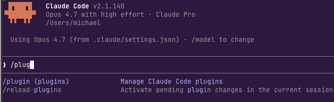
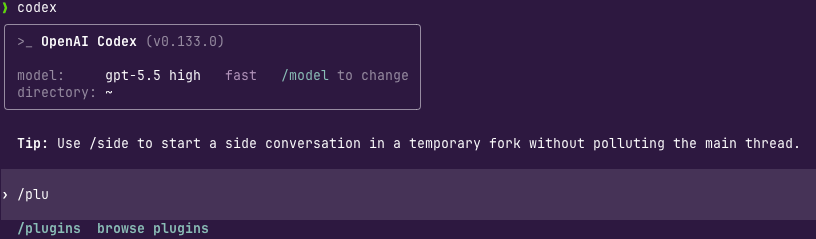
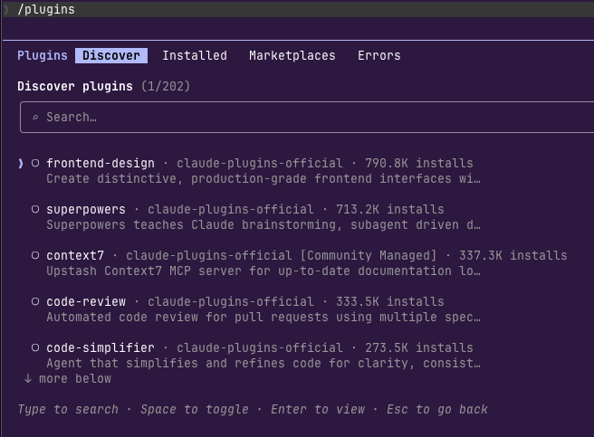

As you're creating your AI workstation/workflows, there are a few things that you won't exactly get from an LLM, but instead, systems that you can build around the LLM to get even better results out of your Agent workflows.

## Plugins

Within both Claude and Codex, you'll see an option for `/plugins`.




Plugins are like specialized skills that you can use based on what you're trying to accomplish. For example, the **frontend-design** plugin is used a lot by designers and frontend engineers.





## AGENTS.md or CLAUDE.md

If you use claude, you'll most likely use a `CLAUDE.md` file. For opencode or Codex, it'll be an `AGENTS.md` file. You can think of this file almost like a universal instruction. You'll define it for things like "always prompt me before editing code" and "you're a principal software engineer". You can make it project specific (put the .MD file in a repo) or global (put it in your home directory for each runtime (e.g - Claude, Codex, opencode, etc.))

Here's an example I have for opencode:
```
## Scope
- This directory is the global opencode config, not an application repo.
- Edit opencode behavior through `opencode.jsonc` or files under this directory; config changes require quitting and restarting opencode.

## Working Style
- Operate like a principal engineer: diagnose root causes, check assumptions against files, and prefer small correct changes over broad rewrites.
- Be concise with investigation and communication; gather enough context to avoid mistakes, but do not spend tokens on obvious facts or low-value exploration.
- Before running any shell command, ask the user for a yes/no confirmation and wait for approval.

## Config
- `opencode.jsonc` is strict opencode config and must keep `$schema: "https://opencode.ai/config.json"`.
- Before adding unfamiliar opencode fields, verify exact shape against `https://opencode.ai/config.json`; invalid fields can prevent startup.

## Node Package
- `package.json` only pins opencode plugin types: `@opencode-ai/plugin@1.4.1`.
- No npm scripts are defined; do not invent `npm test`, `npm lint`, or build commands for this directory.
- If dependencies need refresh, use `npm install` so `package-lock.json` stays authoritative.

## Files To Ignore
- `node_modules/`, `package.json`, `package-lock.json`, `bun.lock`, and `.gitignore` are ignored here by design.
- Do not use files under `node_modules/` as repo conventions; they are vendored dependencies.
```

## Agent Skills

Agent Skills are a set of instructions, code examples, and documents used to enhance the knowledge of an Agent. For example, if you're writing a backend in Python, you might have a "python-engineer-skill" that has code examples for backends/APIs along with links to some documentation to engineering in Python. You can create a Skill for anything.

You can see a few skills I've created for kagent and agentgateway [here](https://github.com/AdminTurnedDevOps/agentic-demo-repo/tree/main/claude-setup/skills)