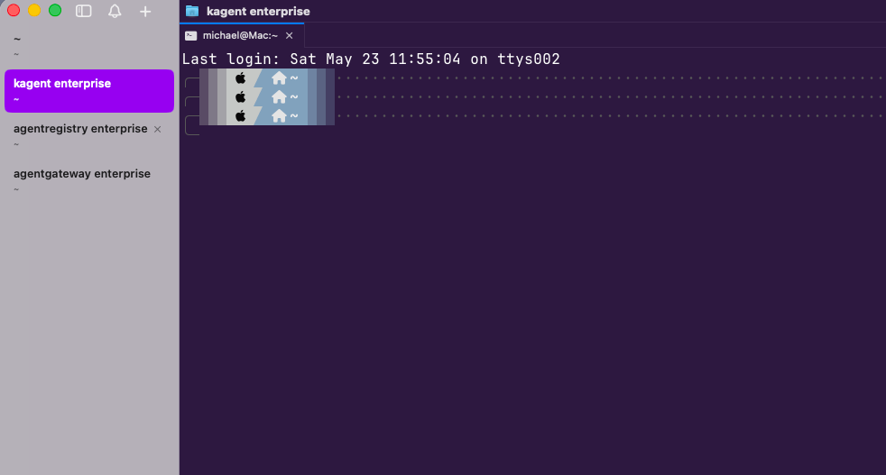
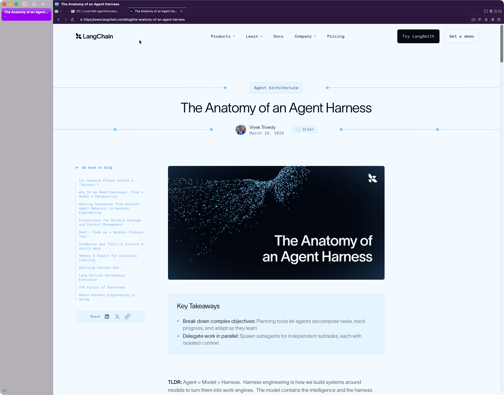

Your terminal is typically going to come from one of two places:

1. A standard terminal (iTerm, Ghostty, etc.)
2. From your IDE (e.g - terminal in VS Code)

Originally, my daily driver was VS Code with the terminal. I would have multiple terminal windows open that would have various Agents running. I like this because I get to see the code that is being edited and added because I have the project open within VS Code.

However, one thing I started to dive into pretty recently is [cmux](https://cmux.com/). It's really neat because it allows you to have multiple tabs open for each project you're working on and within those tabs, you can open up terminals and web browsers, which I really enjoy. Although I use Agents for a lot of my engineering tasks, I still do prefer to look at the code, the the instructions written, and manually run them myself within the terminal. Because of that, using an IDE like VS Code still makes sense. Luckily with cmux, I can just `cat` a file that was created in a project and then run the commands via the terminal. I can also do the same for code that was edited/created, so I can definitely see myself moving away from a code editor at some point.

Try both and see what works for you:
1. A code editor with a terminal
2. cmux (terminal + browser)

Top tools right now in the terminal space:
1. VS Code
2. cmux

